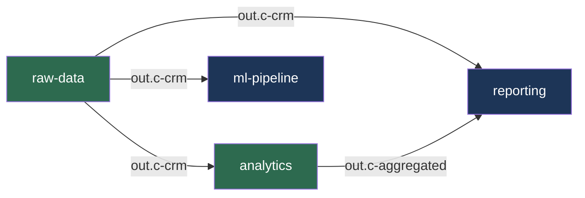

* TOC
{:toc}


Ten scenarios showing how `kbagent` fits into everyday data engineering work.
Each one is a self-contained story: the situation, the commands, and why it matters.

---

## 1. Onboard an entire organization and get an AI-powered summary

**Situation:** You just joined a company that has 40+ Keboola projects spread across
two stacks. You need to understand the landscape -- fast.

```bash
# Register every project from the organization (one command per stack)
kbagent org setup --org-id 123 --url https://connection.keboola.com --yes
kbagent org setup --org-id 456 --url https://connection.eu-central-1.keboola.com --yes
```

All 40 projects are now connected with auto-created Storage API tokens.
Now tell your AI assistant to explore:

> **Prompt for Claude Code:**
> Run `kbagent context` to learn the CLI, then use `kbagent config list`
> and `kbagent lineage show` to give me a summary of what's happening
> across all projects -- which pipelines exist, how data flows between
> projects, and what components are used most.

The AI queries all projects in parallel and gives you a structured overview
in minutes instead of hours of clicking through the UI.

---

## 2. Audit configurations across all projects

**Situation:** Security asks you to find every configuration that references
a specific database host, or check if anyone hardcoded credentials somewhere.

```bash
# Search for a hostname across all projects
kbagent config search --query "legacy-db.internal.company.com" --ignore-case

# Find configs that might have hardcoded passwords
kbagent config search --query "password" --ignore-case

# Pull everything for offline grep / deeper analysis
kbagent sync pull --all-projects
grep -r "legacy-db" */main/
```

One command searches config bodies across every project. The search reports
which project, component, config, and JSON path matched -- no need to click
through 40 project UIs.

> **Prompt for Claude Code:**
> Use `kbagent config search --query "password" --ignore-case` across all
> projects. For each match, check if it's a properly encrypted `#password`
> field or a plaintext leak. Give me a report with project, component,
> config name, and whether the credential is safe or needs rotation.

---

## 3. Debug a failing SQL transformation with AI

**Situation:** A Snowflake transformation fails at step 3 of 7. Running the whole
job takes 25 minutes. You want to iterate on just the broken query.

> **Prompt for Claude Code:**
> The transformation config 12345 in project "analytics" is failing.
> Use `kbagent workspace from-transformation` to create a workspace with
> the input tables, then use `kbagent job detail` to find the error,
> and iterate on the SQL with `kbagent workspace query` until it works.
> Show me what was wrong and what you fixed.

What the AI does behind the scenes:

```bash
# Check the error
kbagent job list --project analytics --component-id keboola.snowflake-transformation --status error --limit 1
kbagent job detail --project analytics --job-id 987654321

# Create a workspace pre-loaded with the transformation's input tables
kbagent workspace from-transformation \
  --project analytics \
  --component-id keboola.snowflake-transformation \
  --config-id 12345

# Run and iterate on the failing query
kbagent workspace query --project analytics --workspace-id 98765 \
  --sql "SELECT customer_id, COUNT(*) FROM orders GROUP BY 1 HAVING COUNT(*) > 1"

# Clean up
kbagent workspace delete --project analytics --workspace-id 98765
```

The edit-run cycle drops from 25 minutes to seconds. The workspace has all the
same tables and data the transformation would see.

---

## 4. Full git + Keboola branch development workflow

**Situation:** You need to change a production transformation. You want the safety
of both git branches (for code review) and Keboola dev branches (for isolated testing)
before anything touches production.

```bash
# 1. Initialize sync with git-branching support and pull current state
kbagent sync init --project analytics --git-branching
kbagent sync pull --project analytics --with-samples
git add -A && git commit -m "initial sync"

# 2. Create a git branch and link it to a Keboola dev branch
git checkout -b feature/order-dedup
kbagent sync branch-link --project analytics
#    -> Creates a Keboola dev branch named "feature/order-dedup"
#    -> All sync commands now auto-target this dev branch
#    -> Production is NEVER touched from feature branches

# 3. Edit transformation SQL in your IDE (VS Code, Cursor, Claude Code...)
#    File tree looks like:
#      analytics/main/transformation/keboola.snowflake-transformation/
#        order-pipeline/
#          _config.yml        # parameters, input/output mapping
#          transform.sql      # your SQL -- edit this!
#          _jobs.jsonl         # recent job history for context
#      analytics/storage/
#        tables/in.c-raw/orders.json      # table schema
#        samples/in.c-raw/orders/sample.csv  # data preview

# 4. Push changes to the Keboola dev branch for testing
kbagent sync push --project analytics
#    -> targets the dev branch automatically (resolved from git branch)
#    -> secret fields (#password) are auto-encrypted

# 5. Test with a workspace on the dev branch
kbagent workspace from-transformation --project analytics \
  --component-id keboola.snowflake-transformation --config-id 12345
kbagent workspace query --project analytics --workspace-id 98765 \
  --sql "SELECT * FROM orders LIMIT 10"

# 6. Iterate: edit locally, push to dev branch, test in workspace
#    Repeat steps 3-5 until everything works

# 7. Happy? Commit to git and open a PR for code review
git add -A && git commit -m "fix: deduplicate orders before aggregation"
git push -u origin feature/order-dedup

# 8. Merge the Keboola dev branch (returns URL for review in Keboola UI)
kbagent branch merge --project analytics

# 9. Clean up: merge git, pull merged state, unlink branch
git checkout main && git merge feature/order-dedup
kbagent sync pull --project analytics        # fetch merged production state
kbagent sync branch-unlink                   # remove branch mapping
git branch -d feature/order-dedup
```

Your IDE gives you syntax highlighting, autocomplete, and diff views for SQL.
Data samples and table schemas provide context without leaving the terminal.
The Keboola dev branch lets you test changes in isolation -- production is never
touched until you explicitly merge in the Keboola UI.

---

## 5. Scaffold a new extractor from scratch

**Situation:** You need to set up a Snowflake extractor but don't remember
the exact config schema. Instead of guessing JSON, let the CLI generate it.

```bash
# Find the right component
kbagent component list --query "snowflake extractor"

# See what it expects
kbagent component detail --component-id keboola.ex-db-snowflake

# Generate a config scaffold into the current directory
kbagent config new --component-id keboola.ex-db-snowflake \
  --name "Raw orders import" --output-dir .

# The scaffold creates files on your local filesystem:
#   _config.yml         # parameters with correct schema structure
#   _description.md     # placeholder description

# Fill in your values in _config.yml, then push to create it in Keboola
kbagent sync push --project analytics
```

The scaffold comes from actual component schemas and production examples.
Secret fields are marked with `#` prefix and get auto-encrypted on push.

---

## 6. Understand cross-project data flows

**Situation:** Your organization shares data between projects via linked buckets.
Before changing a table schema, you need to know who depends on it.

```bash
# Show data lineage across all connected projects
kbagent lineage show

# Output reveals:
#   Project "raw-data" shares bucket "out.c-crm" with:
#     - Project "analytics" (linked as "in.c-shared-crm")
#     - Project "reporting" (linked as "in.c-shared-crm")
#     - Project "ml-pipeline" (linked as "in.c-crm-data")

# Dive deeper into a specific project's storage
kbagent storage buckets --project raw-data
kbagent storage tables --project analytics --bucket in.c-shared-crm
```

One command maps all sharing relationships. Now ask AI to visualize it:

> **Prompt for Claude Code:**
> Run `kbagent --json lineage show` and create a Mermaid diagram showing
> the data flow between all projects. Use different colors for source
> projects (that share data) vs consumer projects (that receive data).
> Show bucket names on the edges. Save it as `docs/lineage-map.md`.

The AI generates something like:

~~~markdown

~~~

You get a visual map of your entire data platform in seconds.

---

## 7. Monitor job health across the organization

**Situation:** Monday morning. You want a quick overview of what failed
over the weekend across all projects.

```bash
# Check failed jobs across all projects
kbagent job list --status error --limit 5

# Drill into a specific failure
kbagent job detail --project marketing --job-id 987654321

# Search for the failing config's setup
kbagent config detail --project marketing \
  --component-id keboola.ex-google-ads --config-id 456

# Check overall project health
kbagent doctor --fix
```

The `--json` flag makes it easy to pipe into scripts, Slack notifications,
or monitoring dashboards. Every command works across all projects by default.

---

## 8. Back up and version-control project configurations

**Situation:** You want a git history of all configuration changes across
your Keboola projects -- a safety net before major changes and an audit trail.

```bash
# Initialize a git repo for your Keboola configs
mkdir keboola-backup && cd keboola-backup
git init
kbagent init --from-global   # use globally registered projects

# Pull all projects with job history and storage metadata
kbagent sync pull --all-projects --with-jobs --with-storage

# Commit the snapshot
git add -A && git commit -m "Weekly backup $(date +%Y-%m-%d)"

# Next week, pull again and see what changed
kbagent sync pull --all-projects --with-jobs --with-storage
git diff                     # shows exactly what changed
git add -A && git commit -m "Weekly backup $(date +%Y-%m-%d)"
```

Schedule this in CI (cron job) and you have automatic weekly snapshots
with full git diff visibility into what changed, when, and where.

---

## 9. Let AI agents manage your Keboola projects

**Situation:** You use Claude Code, Cursor, or another AI coding assistant.
You want the AI to understand and work with your Keboola setup.

Install the `kbagent` plugin for Claude Code from the marketplace -- it teaches
the AI how to use all commands, follow proper workflows, and avoid common pitfalls.
Then just talk to it naturally:

> **"Which projects had the most job failures this week?"**
> The AI runs `kbagent job list --status error` across all projects and
> gives you a ranked summary.

> **"Create a new Snowflake extractor that pulls the `users` table from our CRM database"**
> The AI searches components, scaffolds a config, fills in parameters based on
> your description, and pushes it to the project.

> **"Debug why the marketing pipeline broke last night"**
> The AI checks job history, finds the error, creates a workspace, tests the
> failing query, identifies the root cause, and suggests a fix.

> **"Show me all projects that use the deprecated Google Ads extractor"**
> The AI searches configs and gives you a list with project names and config IDs.

The `--json` flag ensures consistent, parseable output for any AI tool:
```json
{"status": "ok", "data": {...}}
{"status": "error", "error": {"code": "...", "message": "...", "retryable": true}}
```

---

## 10. CI/CD: temporary tokens for automated workflows

**Situation:** Your CI pipeline runs `org setup` periodically to sync project access.
You don't want tokens accumulating forever.

```bash
# Create tokens that auto-expire after 24 hours
kbagent org setup --org-id 123 --url https://connection.keboola.com \
  --token-expires-in 86400 --yes

# In your CI script, re-run daily -- old tokens expire, new ones are created
# Safe to re-run: already-registered projects are skipped (idempotent)
```

Expired tokens clean themselves up. No manual rotation needed.

---

## Getting Started

```bash
# Install
uv pip install keboola-cli

# Add your first project
kbagent project add --project analytics \
  --url https://connection.keboola.com \
  --token YOUR_STORAGE_TOKEN

# The name you give here is used in all other commands: --project analytics
# If you omit --project, read commands query ALL connected projects.

# Explore
kbagent config list
kbagent component list --query "what you need"
kbagent doctor
```

Every command supports `--help` for detailed usage.
Use `kbagent context` for the full reference.

