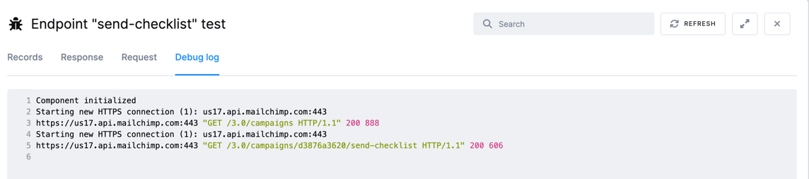

* TOC
{:toc}

On your way through the Generic Extractor tutorial, you have learned about

- [Basic configuration](/extend/generic-extractor/tutorial/basic/) and 
- [Configuration of pagination](/extend/generic-extractor/tutorial/pagination/).

Now we will show you how to use Generic Extractor's **sub-jobs**.

Let's start this section with a closer examination of the `campaigns` resource of the MailChimp API. 
Apart from retrieving multiple campaigns using the `/campaigns` endpoint, it can also retrieve detailed 
information about a single campaign using `/campaigns/{campaign_id}`. 

{: .image-popup}

Moreover, each campaign has three **sub-resources**: 
`/campaigns/{campaign_id}/content`, `/campaigns/{campaign_id}/feedback` 
and `/campaigns/{campaign_id}/send-checklist`. The `{campaign_id}` expression represents a placeholder 
that should be replaced by a specific campaign Id. To retrieve the sub-resource, use child jobs. 

## Child Jobs

In the 
[previous part](/extend/generic-extractor/tutorial/pagination/#running) of the tutorial, you created this job 
property in the Generic Extractor configuration:


"jobs": [
    {
        "endpoint": "campaigns",
        "dataField": "campaigns"
    }
]


All sub-resources are retrieved by configuring the `children` property in JSON; its structure is the same as the 
structure of the `jobs` property, but it must additionally define `placeholders`.

In the UI you just create a new Endpoint and mark it as a `Child Job` of the parent job of your choice. Any placeholders, 
e.g. variables that will be set from the parent object should be enclosed in curly braces. e.g. `{campaign_id}`. 

{: .image-popup}

Once the endpoint is created the `Placeholders section` will be prefilled for you. We will set the `Response Path` value to `id`,
since we want to use the `id` property from the parent response to replace the `{campaign_id}` placeholder in the child endpoint.

{: .image-popup}

Now you can test the endpoint as in previous examples. 
The  `Mapping.Data Selector` (aka `dataField`) property must refer to an array, i.e. `items` or `_links` in our case 
(see the [documentation](https://mailchimp.com/developer/reference/campaigns/campaign-checklist/)).

Now when you look at the debug log you will also see that the connector is making all the parent requests:

{: .image-popup}

**The resulting underlying JSON will look like this:**


"jobs": [
    {
        "endpoint": "campaigns",
        "dataField": "campaigns",
        "children": [
            {
                "endpoint": "campaigns/{campaign_id}/send-checklist",
                "dataField": "items",
                "placeholders": {
                    "campaign_id": "id"
                }
            }
        ]
    }
]


The `children` are executed for each element retrieved from the parent endpoint, i.e. for each campaign.
The `placeholders` setting connects the placeholders used in the `endpoint` property with 
the data in the actual parent response. 
That means that the `campaign_id` placeholder in the `campaigns/{campaign_id}/send-checklist` endpoint 
will be replaced by the `id` property of the JSON [response](https://mailchimp.com/developer/reference/campaigns/): 

{: .image-popup}

Also note that the placeholder name is completely arbitrary (i.e. it is just a coincidence that
it is also named `campaign_id` in the Mailchimp documentation). Therefore, the following configuration is 
also valid:


{
    "parameters": {
        "api": {
            "baseUrl": "https://us13.api.mailchimp.com/3.0/",
            "authentication": {
                "type": "basic"
            },
            "pagination": {
                "method": "offset",
                "offsetParam": "offset",
                "limitParam": "count",
                "limit": 1
            }            
        },
        "config": {
            "debug": true,
            "username": "dummy",
            "#password": "c40xxxxxxxxxxxxxxxxxxxxxxxxxxxxx-us13",
            "outputBucket": "ge-tutorial",
            "jobs": [
                {
                    "endpoint": "campaigns",
                    "dataField": "campaigns",
                    "children": [
                        {
                            "endpoint": "campaigns/{cid}/send-checklist",
                            "dataField": "items",
                            "placeholders": {
                                "cid": "id"
                            }
                        }
                    ]
                }
            ]
        }
    }
}


Running the above configuration gives you a new table named, for example, 
`in.c-ge-tutorial.campaigns__campaign_id__send-checklist`. The table
contains messages from campaign checking. You will see something like this:

{: .image-popup}

Note that apart from the API response properties `type`, `heading` and `details`, an additional field 
`parent_id` was added. This contains the value of the placeholder (`campaign_id`) for the particular 
request. So to join the two tables together in SQL, you would use the join condition: 

    campaigns.id=campaigns__campaign_id__send-checklist.parent_id

You have to remember to what table the `parent_id` column refers though.

## Multiple Jobs
You have probably noticed that the `jobs` and `children` properties are arrays. It means that you can retrieve multiple 
endpoints in a single configuration. Let's pick the campaign `content` sub-resource too:

{: .image-popup}

The placeholder configuration is the same, however,
the question is what to put in the `Data Selector` (`dataField`). If you examine the sample [response](https://mailchimp.com/developer/reference/campaigns/campaign-content/),
after running the test endpoint, it looks like this:



{
  "plain_text": "** Designing...*|END:IF|*",
  "html": "<!DOCTYPE html...</html>",
  "_links": [
    {
      "rel": "parent",
      "href": "https://usX.api.mailchimp.com/3.0/campaigns/42694e9e57",
      "method": "GET",
      "targetSchema": "https://api.mailchimp.com/schema/3.0/Campaigns/Instance.json"
    },
    ...
  ]
}



If you use JSON configuration with no `dataField` like in the above configuration and run it, you will obtain a table like this:

{: .image-popup}

This is definitely not what you expected. Instead of obtaining the campaign content, you 
got the `_links` property from the response. This is because Generic Extractor automatically 
picks an array in the response. To get the entire response as a **single table record**, set `dataField` 
to the [path](/extend/generic-extractor/tutorial/json/#references) in the object. Because you want to use the 
**entire response**, set `dataField` to `.` to start in the root. 

**NOTE** if you are using the UI editor, the `Data Selector` (`dataField`) is automatically `.` by default.

**The resulting JSON:**


"jobs": [
    {
        "endpoint": "campaigns",
        "dataField": "campaigns",
        "children": [
            {
                "endpoint": "campaigns/{campaign_id}/send-checklist",
                "dataField": {
                      "path": "items",
                      "delimiter": "."
                    },
                "placeholders": {
                    "campaign_id": "id"
                }
            },
            {
                "endpoint": "campaigns/{campaign_id}/content",
                "dataField": {
                      "path": ".",
                      "delimiter": "."
                    },
                "placeholders": {
                    "campaign_id": "id"
                }
            }
        ]
    }
]


Running the above configuration will get you the table `in.c-ge-tutorial.campaigns__campaign_id__content`
with columns like `plain_text`, `html` and others. 

You will also get the table `in.c-ge-tutorial.campaigns__campaign_id__content__links`. It 
represents the `links` property of the `content` resource. The links table contains the 
`JSON_parentId` column which contains a generated hash, such as 
`campaigns/{campaign_id}/content_1c3b951ece2a05c1239b06e99cf804c2` whose value is inserted into
the `links` column of the campaign content table. This is done automatically because once
you said that the entire response was supposed to be a single table row, the array `_links` 
property will not fit into a single value of a table.

## Summary
Now that you know how to extract sub-resources using child jobs, as well as resources composed directly of 
properties (without an array of items), you probably think that the `_links` property, found all over the 
MailChimp API and giving us a lot of trouble, is best to be ignored. The answer to this is 
**mapping** described in the [next part](/extend/generic-extractor/tutorial/mapping/) of the tutorial. 

You might have also noticed some duplicate records in the table `in.c-ge-tutorial.campaigns__campaign_id__content` 
along the way. You'll see into this as well.