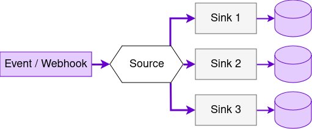

    <i class="fas fa-exclamation-circle"></i>
    <strong>Warning:</strong> Data Streams is an <strong>experimental feature</strong>.

The Keboola Stream API allows you to ingest small, frequent events into your project's storage.

See the [tutorial](/integrate/data-streams/tutorial/) to learn how to create and manage event sources.

## Next Steps
- [Data Streams Tutorial](/integrate/data-streams/tutorial/)
- [Data Streams Overview](/integrate/data-streams/overview/)
