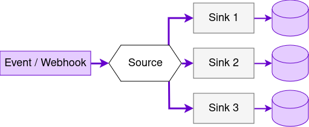

* TOC
{:toc}

A source represents an endpoint for receiving events.

Sources are managed using the Stream API. The full API reference is available at https://stream.keboola.com/v1/documentation/, and the OpenAPI specification is available at https://stream.keboola.com/v1/documentation/openapi3.json.

Events are received using HTTP. Sources are associated with a maximum of 20 `sinks`. Each sink represents a `mapping` from event data to `columns` in a destination `table`. Data may be mapped using pre-defined mappings, or a custom `template`.

## Columns

|Field|Type|Description|
|:-|:-|:-|
|`name`|string|Name of the column. Names must be unique.|
|`type`|string|The type of the column. Available types and their descriptions are listed below.|
|`primaryKey`|boolean|Make this column a primary key. Multiple columns may be part of the primary key at the same time.|

The available column types are:

|Type| Description                                |
|:-|:-------------------------------------------|
| `id`| event ID                                   |
| `datetime` | time of the event                          |
| `ip` | IP of the event sender                     |
| `body` | the unaltered event body                   |
| `headers` | the unaltered request headers              |
| `path` | a field from json object                   |
| `template` | a custom mapping using a template language |

### Path

The `path` column type can be used to fetch a single field from a `json` object. Optionally you can use `rawString` option to remove the quotes around a json string or a `defaultValue` option to define a value when the field doesn't exist.

```json
{
  "type": "json",
  "name": "id",
  "path": "issue.id",
  "defaultValue": "undefined", 
  "rawString": true
}
```

### Template (Jsonnet)

Note: It is recommended to use the much faster `path` type instead of `jsonnet` function `Body(string)` when possible. 

The `template` column type currently only supports the `jsonnet` templating language. The following `jsonnet` globals are available:

|Name|Description|Usage example|Example value|
|:-|:-|:-|:-|
| `Ip()` | IP address of the client | `Ip()` | `127.0.0.1` |
| `Body()` | Get the entire request body as an object. | `Body()` | `{ "a": "b" }` |
| `Body(string)` | Get a field from the request body by path. Fails if the header does not exist, in which case the record will not be saved. | `Body("deeply.nested.path")` | `1000` |
| `Body(string, any)` | Get a field from the request body by path, or a default value. | `Body("deeply.nested.path", 2000)` | `1000` |
| `BodyStr()` | Get the entire request body as a string. | `BodyStr()` | `"{\"a\":\"b\"}"` |
| `Header()` | Get all request headers. | `Header()` | `{ "Content-Type": "application/json" }` |
| `Header(string)` | Get the value of a single request header. Fails if the header does not exist, in which case the record will not be saved. | `Header("Content-Type")` | `"application/json"` |
| `Header(string, string)` | Get the value of a single request header, or a default value. | `Header("Content-Type")` | `"application/json"` |
| `HeaderStr()` | Get the request headers as a string, each line containing one "header: value" pair. The lines are sorted alphabetically. | `HeaderStr()` | `Content-Type: application/json` |
| `Now()` | Get the current UTC datetime as a string formatted using the default format. | `Now()` | `"2023-01-14T08:04:05.123Z"` |
| `Now(string)` | Get the current UTC datetime as a string formatted using a custom [`strftime`](https://man7.org/linux/man-pages/man3/strftime.3.html)-compatible format. | `Now("%Y-%m-%d")` | `2023-01-14` |

### Conditions

Incoming events are immediately mapped to the schema defined in each sink, and each new row is appended to a CSV file on local harddisk (local storage).

When the local storage has enough records or a short time passes, the records from the local storage are appended to a CSV file stored in your Keboola project (staging storage).

When certain conditions are met, the data from the file is imported to the destination table (target storage). These `conditions` are defined by the sink:

| Condition | Minimum |  Maximum   |   Default   |
| :- | :-: |:----------:|:-----------:|
| `time` | 30 seconds |  24 hours  |  1 minute   |
| `size` | 100 B |   500 MB   |    50 MB    |
| `count` | 1 | 10 million | 50 thousand |

If you change the conditions, all waiting files are imported immediately. Afterward the stream behaves according to the new conditions.

## Create Sources and Sinks

Sources may be created using the [`POST /v1/branches/{branchId}/sources`](https://stream.keboola.com/v1/documentation/#/configuration/CreateSource) endpoint.

If a source or sink `id` is omitted, it will be generated from the corresponding `name` field.

A source may be created without any sinks. The sinks can then be created separately using the [`POST /v1/branches/{branchId}/sources/{sourceId}/sinks`](https://stream.keboola.com/v1/documentation/#/configuration/CreateSink) endpoint.

***Warning**: Events sent to a source without any sinks will be permanently lost. This is because data is buffered per sink, not per source.*

The requests are asynchronous and create a task that must be completed before the source or sink is ready to use. The task status can be checked using the [`GET /v1/branches/{branchId}/sources/{sourceId}/tasks/{taskId}`](https://stream.keboola.com/v1/documentation/#/configuration/GetTask) endpoint.

Sink tables are created if they do not exist. If they already exist, the schema defined by `sink.columns` must match the existing schema. If the table schema is manually altered and it no longer matches, the import from staging storage to the table will fail. The data is kept in the staging storage for up to 7 days during which you can recover any failures.

## Delete Sources and Sinks

Sources may be deleted using the [`DELETE /v1/branches/{branchId}/sources/{sourceId}`](https://stream.keboola.com/v1/documentation/#/configuration/DeleteSource) endpoint. Sinks may be deleted using the [`DELETE /v1/branches/{branchId}/sources/{sourceId}/sinks/{sinkId}`](https://stream.keboola.com/v1/documentation/#/configuration/DeleteSink) endpoint.

## Update Sources and Sinks

A source may be updated using the [`PATCH /v1/branches/{branchId}/sources/{sourceId}`](https://stream.keboola.com/v1/documentation/#/configuration/UpdateSource) endpoint. Sinks maybe updated using the [`PATCH /v1/branches/{branchId}/sources/{sourceId}/sinks/{sinkId}`](https://stream.keboola.com/v1/documentation/#/configuration/UpdateSink) endpoint.

The `UpdateSource` endpoint may only update the source's name. Sinks may only be updated separately.

If a sink's `mapping.tableId` is updated, it is handled the same way as in the create operation. If the table exists, `mapping.columns` must match the existing table's schema. If the table does not exist, it is created.

## Source and Sink Settings

The import conditions mentioned above can be accessed using the [`GET /v1/branches/{branchId}/sources/{sourceId}/settings`](https://stream.keboola.com/v1/documentation/#/configuration/GetSourceSettings) endpoint and changed using the [`PATCH /v1/branches/{branchId}/sources/{sourceId}/settings`](https://stream.keboola.com/v1/documentation/#/configuration/PatchSourceSettings) endpoint.

Same settings also exist for a sink. Use the [`GET /v1/branches/{branchId}/sources/{sourceId}/sinks/{sinkId}/settings`](https://stream.keboola.com/v1/documentation/#/configuration/GetSinkSettings) endpoint and [`PATCH /v1/branches/{branchId}/sources/{sourceId}/sinks/{sinkId}/settings`](https://stream.keboola.com/v1/documentation/#/configuration/PatchSinkSettings) endpoint in that case.

## Delivery guarantees

Depending on your use-case you may need different delivery guarantees for your stream. Follow the guide-lines below to ensure the desired outcome.

### At most once

To ensure no record is delivered twice, make sure that the client doesn't have retries when sending the records. In this case it's beneficial to use the settings endpoints to set `"storage.level.local.encoding.sync.wait"` to `false` in order to increase the throughput.

### At least once

In order to have every record delivered at least once, the client needs to implement retries for sending the records. Also use the settings endpoints to make sure that `"storage.level.local.encoding.sync.wait"` is set to `true` (default behavior). Note that this settings guarantees that the record was written to the local disk.

### Exactly once

Follow the instructions above for "At least once" delivery. Additionally, you need to have a primary key defined in your stream in order for Keboola to automatically deduplicate the records.

## Tokens

A token is generated for each source sink. These tokens have the minimum possible scope, which is a `write` permission for the bucket in which the destination table is stored. You can see these tokens at `https://connection.keboola.com/admin/projects/<project-id>/tokens-settings`. Their description is in the format `[_internal] Stream Sink <source-id>/<sink-id>`.

These tokens should not be deleted or refreshed manually. To refresh tokens, you can disable and re-enable the Sink.

## Kafka Integration
To connect Keboola with [Apache Kafka®](https://kafka.apache.org/) and ingest data from Kafka topics via data streams, use the Kafka Connect HTTP Sink Connector
to establish a communication channel between Kafka and Keboola.

The Kafka Connect HTTP Sink Connector acts as a bridge, seamlessly integrating Kafka with Keboola's Data Stream HTTP API. Here's a breakdown of the process:

- Data Consumption: The connector continuously reads data records from one or more Kafka topics.
- Batching: The events can be efficiently grouped based on a predefined maximum size (batch.max.size).
- API Interaction: The data is sent as the POST request in JSON format to Keboola's Data Stream API URL.

**Key Points to Remember:**

- This integration relies on the Kafka Connect HTTP Sink Connector, requiring configuration on the Kafka side.
- Data records from Kafka topics are transformed into strings before being sent to Keboola.
- The target Keboola API URL is represented by the created data stream in Keboola.
- Only POST HTTP methods are supported for data ingestion.

## Next Steps

- [Data Streams Tutorial](/integrate/data-streams/tutorial/)
- [Stream API Reference](https://stream.keboola.com/v1/documentation/)
