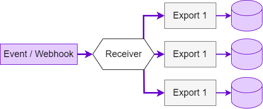

* TOC
{:toc}

**Warning: "Push Data" is an experimental feature.**

The Keboola Buffer API allows you to ingest small and frequent events into your project's storage.

See the [tutorial](/integrate/push-data/tutorial/) to learn how to create and manage event receivers.

## Next Steps
- [Push Data Tutorial](/integrate/push-data/tutorial/)
- [Push Data Overview](/integrate/push-data/overview/)
