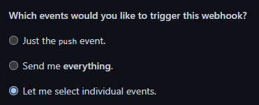
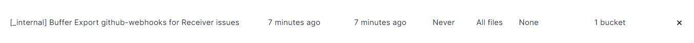
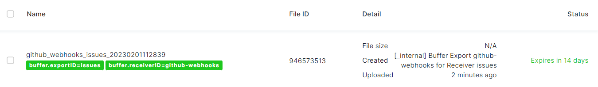
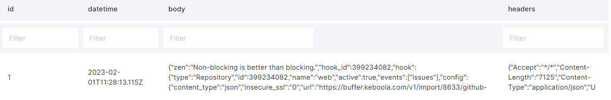

* TOC
{:toc}


In this tutorial, we will set up a receiver for the [`issues`](https://docs.github.com/developers/webhooks-and-events/webhooks/webhook-events-and-payloads#issues) event from GitHub Webhooks. This will allow you to monitor and analyse activity relating to issues in any of your GitHub repositories.

You will need your project's master token, and a GitHub repository in which you have the `Admin` role.

### Creating a Receiver

To start ingesting events, you must first create a receiver. Send the following payload to the `https://buffer.keboola.com/v1/receivers` endpoint:
```
{
  "name": "Github Issues",
  "exports": [
    {
      "name": "Events",
      "conditions": { "count": 1 },
      "mapping": {
        "tableId": "in.c-github.issues",
        "columns": [
          {
            "primaryKey": true,
            "type": "id",
            "name": "id"
          },
          { "type": "datetime", "name": "datetime" },
          { "type": "ip", "name": "ip" },
          { "type": "body", "name": "body" },
          { "type": "headers", "name": "headers" },
          {
            "type": "template",
            "name": "template",
            "template": {
              "language": "jsonnet",
              "content": "'#' + Body('issue.id') + ': ' + Body('issue.body', 'n/a')",
            }
          }
        ]
      }
    }
  ]
}
```

You can do this using `curl`, or anything else that allows you to send an HTTP request:
```
$ curl --header 'Content-Type: application/json' \
       --header 'X-StorageApi-Token: <YOUR_TOKEN>' \
       --data '{ ...the payload above... }' \
       https://buffer.keboola.com/v1/receivers
```

Upon success, the response will contain the receiver you've just created:
```
{
  "id": "github-issues",
  "url": "https://buffer.keboola.com/v1/import/<YOUR_PROJECT_ID>/github-issues/<SECRET>"
  "name": "Github Issues",
  "exports": [
    {
      "id": "events",
      "name": "Events",
      "conditions": {
        "count": 1,
        "size": "5MB",
        "time": "5m"
      },
      "mapping": {
        "tableId": "in.c-github.issues",
        "columns": [
          {
            "primaryKey": true,
            "type": "id",
            "name": "id"
          },
          { "type": "datetime", "name": "datetime" },
          { "type": "ip", "name": "ip" },
          { "type": "body", "name": "body" },
          { "type": "headers", "name": "headers" },
          {
            "type": "template",
            "name": "template",
            "template": {
              "language": "jsonnet",
              "content": "'#' + Body('issue.id') + ': ' + Body('issue.body', 'n/a')",
            }
          }
        ]
      }
    }
  ]
}
```

The most important part of the response is the `url` field. This is the endpoint you will point your GitHub webhook to. Once you've created the receiver and obtained its `url` field, you are ready to configure the GitHub webhook.

### Configuring the Github Webhook

Go to the `Settings` tab of your repository.


Open the `Webhooks` page.


Click `Add webhook`.


Enter the receiver `url` into the `Payload URL` field, and set the `Content Type` to `application/json`.


For `Which events would you like to trigger this webhook?`, click `Let me select individual events`, then find `Issues` and tick it:




Click `Add webhook` at the bottom of the page.

Any events related to issues in your repository will now be buffered by the receiver, and uploaded to your table every minute.

To see your integration at work, head over to your repository and [open a few issues](https://docs.github.com/en/issues/tracking-your-work-with-issues/creating-an-issue).

### Results

The following token was generated.



This token only has the minimal set of permissions, which in this case is access to a single bucket, and the ability to manipulate files. Currently, files are used as staging storage in order to prevent data loss. You can see these files in your project's Storage.



Because the table `in.c-github-issues` did not exist, it was created.


And finally, you can take a look at the destination table's data sample to find your data, ready for further processing.




## Next Steps
- [Push Data Overview](/integrate/push-data/overview/)
- [Buffer API Reference](https://buffer.keboola.com/v1/documentation/)
